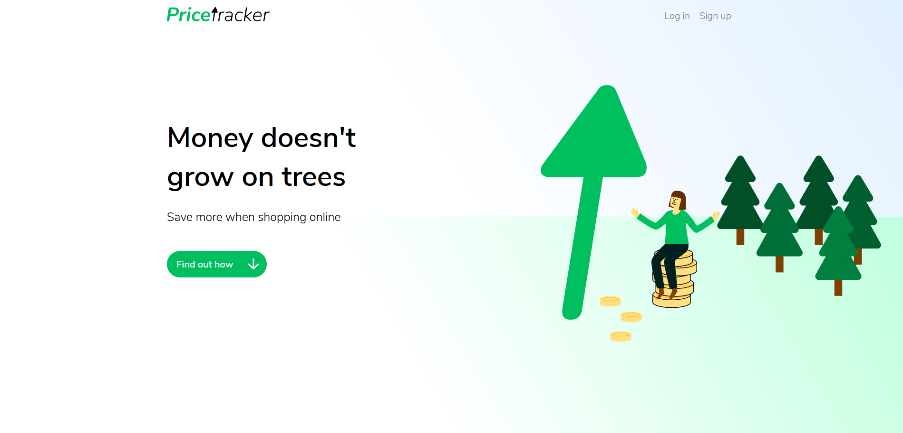

# Price tracker

A web app to track the price of online items.

## Features

- User authentication
- Hourly price checking
- User notifications
- Support for multiple currencies

## Technologies

#### Front end
- [HTML5](https://html.spec.whatwg.org/)
- [SCSS](https://sass-lang.com/)
- [JavaScript](https://www.w3schools.com/js/default.asp)

#### Back end
- [Flask](https://flask.palletsprojects.com/)